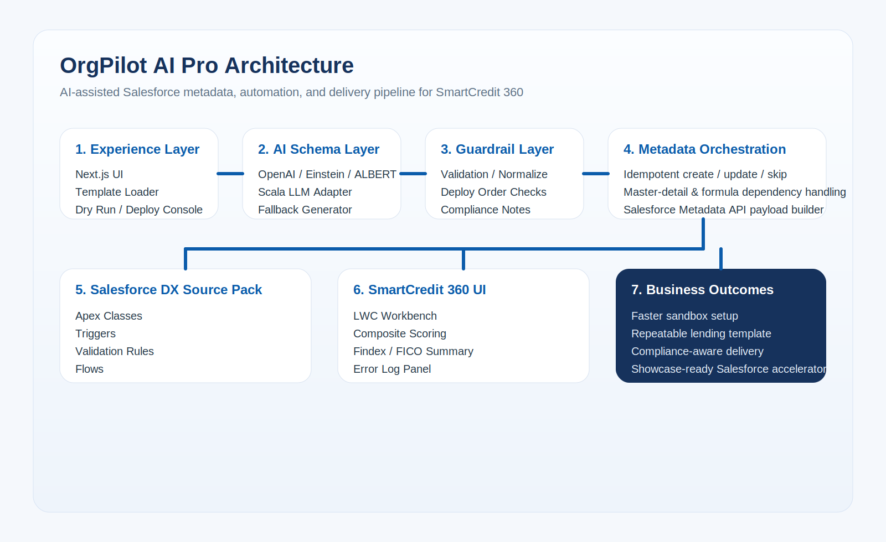
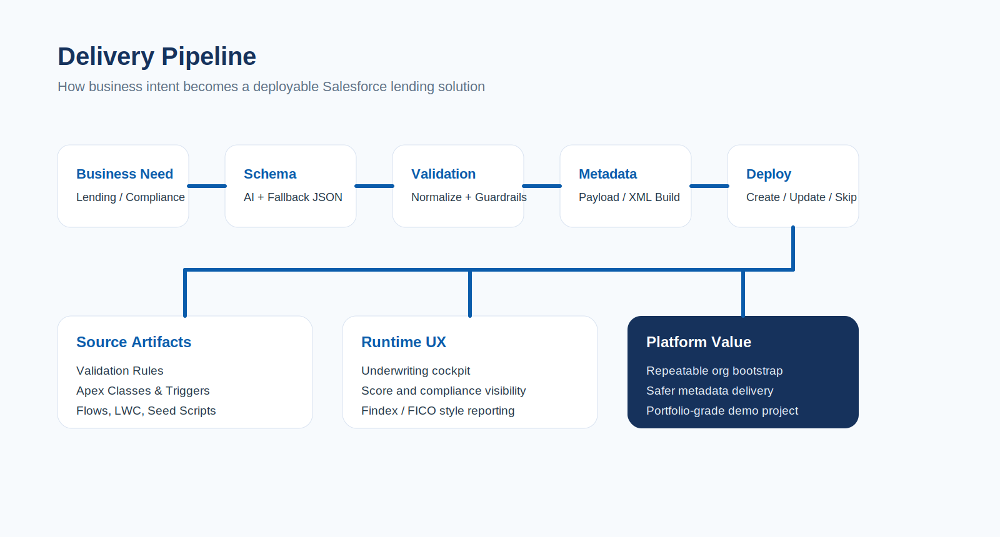

# OrgPilot AI Pro

AI destekli Salesforce metadata ve automation builder.

Bu proje, finansal servisler ve lending senaryoları için Salesforce üzerinde kurumsal veri modeli, validasyon, Apex otomasyonu, LWC ekranları ve deploy akışını hızlandırmak için geliştirildi. Çekirdekte iki farklı üretim hattı var:

- `Metadata API builder`: JSON schema'dan object ve field deploy eder.
- `Salesforce DX source pack`: `force-app` altında validation rule, trigger, class, flow ve LWC source üretir.




## Proje Özeti

Bu sistemin amacı sadece “AI ile obje oluşturmak” değil. Asıl hedef, regülasyonlu bir domain için uçtan uca hızlandırılmış bir Salesforce delivery platformu kurmaktı:

1. İş birimi veya ürün sahibi veri modeli ihtiyacını tanımlar.
2. Sistem bunu güvenli JSON schema'ya dönüştürür.
3. Schema validate edilir, normalize edilir ve deploy planına çevrilir.
4. İlişkisel bağımlılıklar, duplicate metadata, master-detail edge case'leri ve formula sıralaması yönetilir.
5. Ardından kurumsal katman olan Apex, validation rule, flow, LWC ve anonymous seed script'leri üretilir.

Sonuç olarak bu repo, bir Salesforce admin aracından daha çok, “AI-assisted Salesforce solution accelerator” gibi davranır.

## CV'de Nasıl Anlatılır

Bu projeyi CV veya mülakatta şu çerçevede anlatabilirsin:

- Salesforce için AI destekli metadata orchestration platformu geliştirdim.
- Next.js + TypeScript tabanlı bir builder ile JSON schema üretimi, validation, normalization ve deploy pipeline kurdum.
- Lending domain'ine özel SmartCredit 360 adında, compliance-aware bir endüstri template'i tasarladım.
- Metadata deploy sürecinde duplicate object/field recovery, master-detail edge case handling, phased field deployment ve idempotent retry mantığı implement ettim.
- `force-app` tabanlı kurumsal source pack oluşturarak Apex trigger, service layer, validation rule, LWC ve flow scaffolding ürettim.
- Salesforce delivery sürecini sadece veri modeli değil, automation ve UI katmanına kadar genişlettim.

## İş Problemi

Salesforce projelerinde özellikle finans, kredi, onboarding ve compliance alanlarında şu problemler sık görülür:

- Data model hızlı kurulur ama kurumsal kalite eksik kalır.
- Object ve field üretimi yapılır ama trigger, validation ve UI katmanı sonradan dağınık eklenir.
- Metadata deploy süreçleri duplicate object, relationship ordering ve formula dependency yüzünden kırılır.
- Developer Edition / Sandbox ortamlarında tekrar deploy edilebilir, idempotent bir akış kurulmaz.

Bu proje bu problemlere tek bir delivery hattı ile cevap verir.

## SmartCredit 360 Domaini

Projede örnek olarak ABD lending use case'i seçildi. Bunun sebebi hem iş kuralları hem de regülasyon katmanının zengin olması.

Ana farklar:

| Alan | Türkiye | ABD |
| --- | --- | --- |
| Kimlik | TC Kimlik No | SSN Last 4 |
| Skor | KKB / Findeks | FICO |
| Regülasyon | BDDK / KVKK | TILA / ECOA / FCRA / HMDA / BSA-AML / FDCPA |
| Faiz | Faiz Oranı | APR |
| Tahsilat | Gecikme süreci | DPD bucket / Charge-Off |

Bu yüzden template sadece field üretmiyor; compliance guardrail mantığı da içeriyor.

## Teknik Mimari

### 1. Web Application

- `Next.js 14`
- `TypeScript`
- `Tailwind CSS`
- tek sayfa üzerinden schema preview, dry run ve deploy operasyonları

### 2. AI / Schema Generation Layer

- `OpenAI`
- `Salesforce AI / Einstein adapter`
- `ALBERT / external adapter`
- `Scala LLM service`
- `fallback rule-based generator`

Bu katman ham output üretir; deploy kararını tek başına vermez.

### 3. Validation / Normalization Layer

`lib/validation/schemaValidator.ts`

Burada:

- API name normalization
- field type whitelist
- lookup / master-detail standardizasyonu
- formula defaults
- delete constraint güvenliği
- deploy order uyumu

uygulanır.

### 4. Metadata Build Layer

`lib/salesforce/metadataPayloadBuilder.ts`
`lib/salesforce/metadataXmlBuilder.ts`

Bu katman JSON schema'yı Salesforce metadata payload'una çevirir.

### 5. Deploy Orchestration Layer

`lib/salesforce/deployMetadata.ts`

Bu katman projedeki en kritik mühendislik alanlarından biridir. Burada:

- object create / update fallback
- duplicate metadata recovery
- idempotent deploy mantığı
- phased field deployment
- formula ve summary alanlarını en sona atma
- controlled-by-parent için geçici sharing handling
- duplicate batch'te sadece ilgili field'ları update etme

çözüldü.

### 6. Salesforce DX Source Pack

`force-app/main/default`

Bu klasör artık kurumsal delivery varlıklarını içerir:

- Apex classes
- Triggers
- Validation rules
- Flows
- LWC bundle

## Repo Yapısı

```txt
app/
  api/
    ai/
    salesforce/
    templates/
  page.tsx
docs/
  SMARTCREDIT360_AUTOMATION.md
  assets/
force-app/
  main/default/
    classes/
    flows/
    lwc/
    objects/
    triggers/
lib/
  ai/
  salesforce/
  templates/
  types/
  validation/
scala-llm-service/
scripts/
  apex/
```

## SmartCredit 360 Veri Modeli

Deploy order:

1. `Account` custom fields
2. `Loan_Product__c`
3. `Loan_Application__c`
4. `Credit_Analysis__c`
5. `Collateral__c`
6. `Loan_Agreement__c`
7. `Payment_Schedule__c`
8. `Collections__c`

Ana business entity'ler:

- `Loan_Product__c`
- `Loan_Application__c`
- `Credit_Analysis__c`
- `Collateral__c`
- `Loan_Agreement__c`
- `Payment_Schedule__c`
- `Collections__c`

## Automation Pack

### Validation Rules

Projede şu an 7 validation rule hazır:

- APR positive rule
- credit pull consent rule
- FICO range rule
- adverse action code requirement
- VIN requirement for vehicle collateral
- amount financed vs finance charge rule
- FDCPA opt-out assignment restriction

### Apex Layer

Projede şu an 11 Apex class var:

- Trigger handlers
- Flow invocable actions
- Score service
- Report service
- Compliance service
- Collections recommendation service
- Error log service

### Triggers

Projede 5 trigger bulunuyor:

- `LoanApplicationTrigger`
- `CreditAnalysisTrigger`
- `CollateralTrigger`
- `LoanAgreementTrigger`
- `CollectionsTrigger`

### Flows

Projede 10 flow metadata taslağı bulunuyor:

- intake
- consent/compliance
- underwriting scorecard
- adverse action notice
- collateral review
- agreement boarding
- payment audit
- collections escalation
- fraud / KYC review
- executive exception approval

### LWC

`smartCredit360Workbench`

Bu bileşen şu işlevleri sunar:

- underwriting cockpit görünümü
- composite score hesap özeti
- Findex/FICO-style report summary alanı
- compliance checklist
- error log paneli
- Flow Screen ve Record Page reuse desteği

## Öne Çıkan Mühendislik Kararları

### Idempotent Deploy

Aynı template ikinci kez deploy edildiğinde duplicate object veya duplicate field nedeniyle sürecin çökmesi yerine:

- create denenir
- duplicate algılanırsa update veya skip mantığı çalışır
- deploy kaldığı yerden devam eder

Bu, özellikle Sandbox / Developer Edition demo kurulumlarında çok değerlidir.

### Field Deployment Phasing

Field'lar tek batch'te körlemesine deploy edilmiyor. Bunun yerine:

1. `Lookup` / `MasterDetail`
2. normal scalar fields
3. `Formula` / `Summary`

sıralaması uygulanıyor. Böylece relationship referansı isteyen formula alanları, bağımlı alan oluşmadan deploy edilmiyor.

### ControlledByParent Edge Case Handling

`MasterDetail` içeren ve `ControlledByParent` kullanan objelerde Salesforce create anındaki sharing beklentisi sorun çıkarabiliyor. Bunun için özel geçici paylaşım modeli ve final update akışı kurgulandı.

## Deploy Stratejileri

Projede iki deploy stratejisi var.

### Strateji 1: Metadata API

Next.js API route'ları veya `jsforce` üzerinden:

- object create
- field create
- update fallback

çalışır.

Route'lar:

- `POST /api/salesforce/deploy-model`
- `POST /api/salesforce/deploy-object`

### Strateji 2: Salesforce DX Source Deploy

Kurumsal source pack için:

```bash
sf project deploy start --source-dir force-app
```

Anonymous Apex seed script örneği:

```bash
sf apex run --file scripts/apex/01_seed_loan_products.apex
```

## Kurulum

```bash
npm install
cp .env.example .env.local
npm run dev
```

Local app:

```txt
http://localhost:3000
```

## Environment Variables

`.env.local` içinde üç ana bağlantı sınıfı var:

- OpenAI ve diğer AI provider endpoint'leri
- Salesforce username/password/token bağlantısı
- opsiyonel access token / instance URL bağlantısı

Önemli olanlar:

- `SALESFORCE_LOGIN_URL`
- `SALESFORCE_USERNAME`
- `SALESFORCE_PASSWORD`
- `SALESFORCE_SECURITY_TOKEN`
- `SALESFORCE_API_VERSION`

## Demo Akışı

Projeyi canlı anlatırken şu sırayı kullanabilirsin:

1. README’de mimariyi göster.
2. `lib/templates/smartcredit360.ts` üzerinden domain modelini anlat.
3. `lib/salesforce/deployMetadata.ts` içinde idempotent deploy mantığını göster.
4. `force-app/main/default/classes` altındaki service ve trigger katmanını anlat.
5. `force-app/main/default/lwc/smartCredit360Workbench` ile UI hikayesini göster.
6. `scripts/apex` ile demo data seed akışını göster.

## Neden Değerli

Bu proje sadece teknik olarak değil, delivery açısından da değer üretir:

- admin ve developer işini ortak bir hatta toplar
- metadata kurulumunu tekrarlanabilir hale getirir
- compliance-aware template yaklaşımı getirir
- POC'den kurumsal yapıya geçişi hızlandırır

## Bilinen Sınırlar

- Flow metadata dosyaları şu an iskelet seviyesinde; full node graph haline getirilebilir.
- Apex test class'ları henüz eklenmedi.
- Permission set, FLS ve flexipage üretimi sonraki iterasyon için açık.
- LWC bileşeni görsel olarak güçlü ama gerçek org datasına bağlanmış `@wire` / Apex controller katmanı henüz minimal tutuldu.

## Sonraki Adımlar

- full record-triggered flow graph'ları üretmek
- permission set ve field-level security eklemek
- Apex test class'ları yazmak
- deploy sonrası smoke test script'i oluşturmak
- React UI içine “generate automation pack” ve “deploy source pack” butonları eklemek

## İlgili Dosyalar

- [SmartCredit automation docs](docs/SMARTCREDIT360_AUTOMATION.md)
- [Template model](lib/templates/smartcredit360.ts)
- [Deploy orchestration](lib/salesforce/deployMetadata.ts)
- [LWC workbench](force-app/main/default/lwc/smartCredit360Workbench/smartCredit360Workbench.js)
- [Salesforce DX project](sfdx-project.json)
