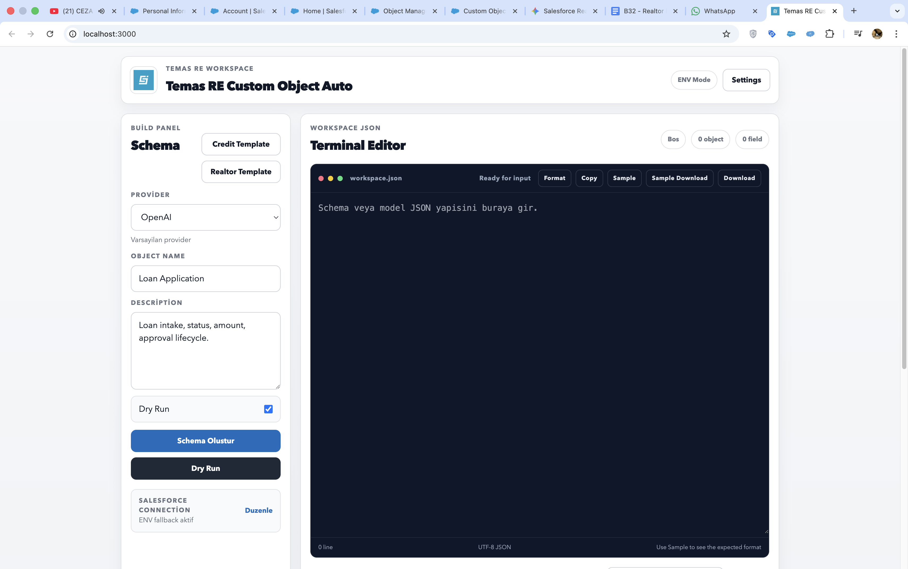
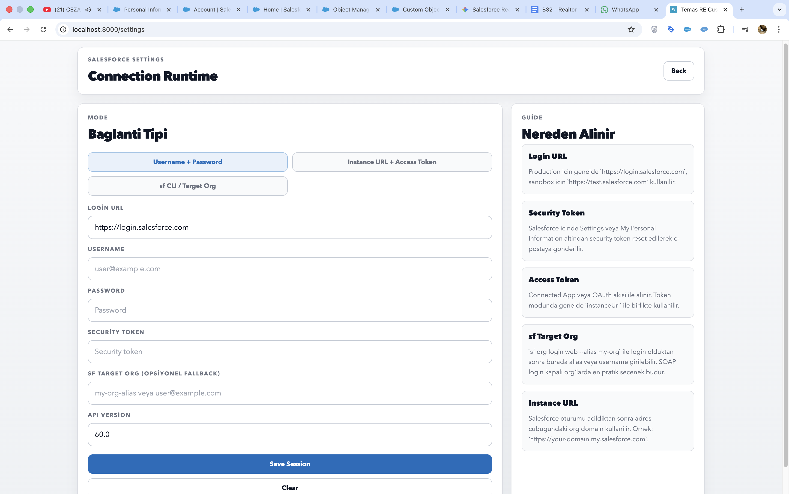

# Temas RE Custom Object Auto

Temas RE Custom Object Auto is a Next.js app for generating, validating, previewing, and deploying Salesforce custom object schemas from a lightweight admin workspace.

Temas RE Custom Object Auto, Salesforce custom object schema'larini uretmek, dogrulamak, onizlemek ve deploy etmek icin gelistirilmis bir Next.js uygulamasidir.




## Project Purpose

### English

The goal of this project is to make Salesforce object delivery faster and safer for internal teams. Instead of manually building object definitions, field lists, and connection flows, the app provides a guided workspace where teams can:

- generate object JSON with AI providers or ready templates
- validate and normalize Salesforce-compatible schema input
- run dry-run checks before deployment
- deploy single objects or full models to Salesforce
- manage runtime Salesforce credentials from the settings screen

### Turkce

Bu projenin amaci, Salesforce custom object teslim surecini ekipler icin daha hizli ve daha guvenli hale getirmektir. Elle object, field ve baglanti ayari yapmak yerine uygulama sunlari saglar:

- AI provider veya hazir template ile schema uretimi
- Salesforce uyumlu JSON icin validation ve normalization
- deploy oncesi dry-run kontrolu
- tek object veya tum model deploy akisi
- settings ekrani uzerinden runtime Salesforce baglanti yonetimi

## Highlights

- Multi-provider schema generation: `OpenAI`, `Salesforce Einstein`, `Albert`, `Scala LLM`, and fallback mode
- Workspace editor with format, copy, sample, and download actions
- Built-in templates for `SmartCredit 360` and `Enterprise Realtor Management`
- Runtime connection modes: `Username + Password`, `Instance URL + Access Token`, `sf CLI / Target Org`
- Activity and trace logging support for generation and deploy actions
- Zod-based schema validation for field types, references, formulas, summary fields, and naming cleanup

## Tech Stack

- `Next.js 14`
- `React 18`
- `TypeScript`
- `Zod`
- `jsforce`
- `OpenAI SDK`

## Getting Started

```bash
npm install
cp .env.example .env.local
npm run dev
```

Open `http://localhost:3000`.

## Environment Variables

Configure the providers and Salesforce connection values in `.env.local`.

Key values:

- `OPENAI_API_KEY`
- `OPENAI_MODEL`
- `SALESFORCE_AI_ENDPOINT`
- `ALBERT_AI_ENDPOINT`
- `SCALA_LLM_ENDPOINT`
- `SALESFORCE_LOGIN_URL`
- `SALESFORCE_USERNAME`
- `SALESFORCE_PASSWORD`
- `SALESFORCE_SECURITY_TOKEN`
- `SALESFORCE_TARGET_ORG`
- `SALESFORCE_API_VERSION`

## Main Flows

### 1. Build Workspace

- Enter an object name and business description
- Select an AI provider or load a template
- Review the generated JSON in the workspace editor

### 2. Validate and Dry Run

- The schema is normalized before deployment
- Unsupported field definitions are corrected when possible
- Warnings and trace entries are returned to the UI

### 3. Deploy to Salesforce

- Deploy a single object or a full model
- Check deployment status through the status endpoint
- Use runtime settings if you do not want to rely only on `.env.local`

## API Routes

- `POST /api/ai/generate-schema`
- `POST /api/salesforce/deploy-object`
- `POST /api/salesforce/deploy-model`
- `GET /api/salesforce/deploy-status`
- `GET /api/templates/smartcredit360`
- `GET /api/templates/enterprise-realtor-management`

## Project Structure

```txt
app/
  api/
  settings/
  page.tsx
docs/
  screenshots/
lib/
  client/
  salesforce/
  templates/
  types/
  utils/
  validation/
public/
```

## Scripts

```bash
npm run dev
npm run build
npm run start
npm run lint
npm run typecheck
```

## Notes

- `.env.local` is intentionally ignored and should not be committed.
- Local Salesforce session/cache folders such as `.sf` and `.sfdx` are ignored.
- The screenshots in this README reflect the latest local UI state as of May 9, 2026.
